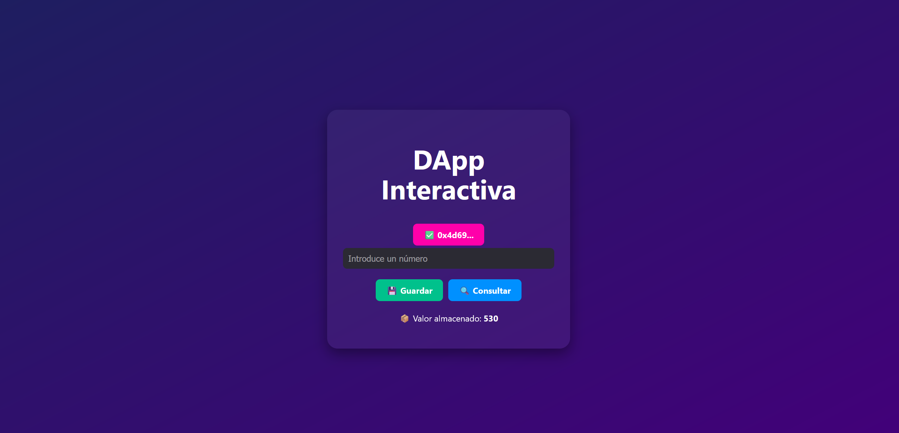

# 🔐 SimpleStorage DApp – Blockchain con React, Truffle y Ganache

Una DApp (aplicación descentralizada) que permite **guardar y consultar un valor en la blockchain** de forma local utilizando Ethereum, Truffle, Ganache, React y MetaMask.

---

## 📦 Requisitos previos

Asegúrate de tener las siguientes versiones instaladas:

| Herramienta       | Versión recomendada  |
|-------------------|----------------------|
| Node.js           | v20.15.1             |
| npm               | v10.7.0              |
| Truffle           | v5.11.5              |
| Ganache CLI       | v7.9.2               |
| MetaMask          | Última versión       |
| Navegador         | Brave / Firefox      |
| MetaMask          | Última versión       |
| Navegador         | Brave / Chrome       |

---

## 🚀 Instalación paso a paso

### 1. Clona el repositorio

```bash
git clone https://github.com/tuusuario/simple-storage-dapp.git
cd simple-storage-dapp
```

### 2. Instala las dependencias de Truffle

```bash
npm install -g truffle
```

### 3. Instala Ganache CLI (si no tienes GUI)

```bash
npm install -g ganache
```

---

## 🛠️ Estructura del proyecto

```
simple-storage-dapp/
├── contracts/
│   └── SimpleStorage.sol      # Contrato inteligente
├── migrations/
│   └── 1_deploy_contracts.js  # Script de despliegue
├── build/
│   └── contracts/             # ABI y artefactos generados
├── dapp-frontend/             # Frontend en React
│   └── src/Hero.jsx           # Componente principal de la DApp
├── truffle-config.js          # Configuración de Truffle
└── README.md                  # Documentación 📘
```

---

## 💻 Cómo ejecutar la DApp localmente

### 1. Inicia Ganache

```bash
ganache
```

Esto iniciará una red local en:  
`http://127.0.0.1:8545`

---

### 2. Compila y despliega el contrato

```bash
truffle migrate --reset --network development
```

✅ Al final verás la dirección del contrato desplegado.  
Copia esa dirección y pégala en tu `Hero.jsx` como:

```js
const CONTRACT_ADDRESS = '0xTuNuevaDireccion';
```

---

### 3. Enlaza MetaMask con Ganache

1. Abre MetaMask
2. Agrega una nueva red manual:
   - Nombre: `Ganache Local`
   - RPC URL: `http://127.0.0.1:8545`
   - Chain ID: `1337`
   - Símbolo: `ETH`

3. Importa una cuenta usando una **clave privada de Ganache**

---

### 4. Ejecuta el frontend

```bash
cd dapp-frontend
npm install
npm run dev
```

Abre: [http://localhost:5173](http://localhost:5173)

---

## 🧪 ¿Qué hace la DApp?

- 🔌 Conecta tu wallet
- 💾 Permite guardar un número en la blockchain
- 🔍 Permite consultar el valor guardado

---

## 📁 Contrato inteligente

```solidity
// SPDX-License-Identifier: MIT
pragma solidity ^0.8.20;

contract SimpleStorage {
    uint private storedValue;

    function set(uint _value) public {
        storedValue = _value;
    }

    function get() public view returns (uint) {
        return storedValue;
    }
}
```

---

## 🧠 Tecnología usada

- [Solidity](https://soliditylang.org/)
- [Truffle](https://trufflesuite.com)
- [Ganache](https://trufflesuite.com/ganache/)
- [React](https://reactjs.org/)
- [Ethers.js](https://docs.ethers.org/v6/)
- [MetaMask](https://metamask.io/)

---

## 🔐 Seguridad y testing

✅ El contrato está pensado para usarse en red local (desarrollo).  
✅ Se puede extender para pruebas en Goerli, Sepolia o cualquier testnet usando Infura o Alchemy.

---

## 📜 Licencia

MIT © kiz4ru, 2025
